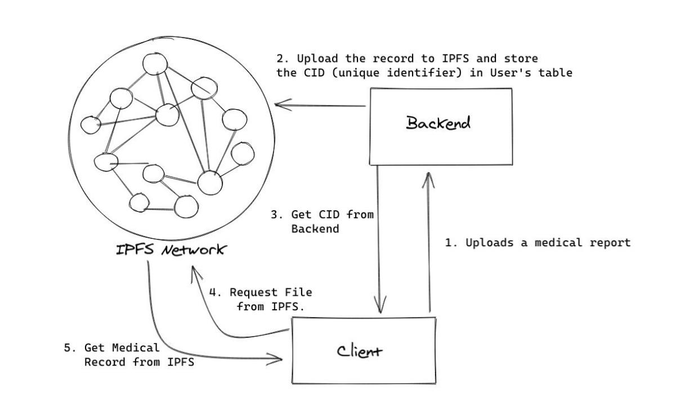

# hygieia-backend

Electronic Health Records - Server

## Overview

Hygieia is a web service that allows it's users to save thier Medical Records electronically. This project aims to provide a decentralised and secure storage for medical records, and that also in a vendor agnostic way. For decentralised storage, we use the IPFS network. For security we provide end-to-end encryption using OpenPGP.

## Setup project

### Server

- Clone the git repo locally using `git clone https://github.com/ayush-020198/hygieia-backend.git && cd hygieia-backend`
- Install dependencies by running `yarn`
- We use MongoDB as database. Setup MongoDB locally or either on cloud.
- Create a `.env` file using the provided `.env.example` and replace the values with your secrets.

### WebUI

Hygieia also has a web frontend. Please refer https://github.com/ayush-020198/hygieia-frontend for setup instructions.

## Usage

- To start a development server with hot-reloading, run `yarn watch`
- To deploy it in production, run `yarn build` to compile the TypeScript code into JS, and then run `yarn start` to start the server.

## Architecture

We architected this web service to solve two different challanges with digital health records:

- Availibility
- Security

### Availibility

We want to access our medical records even in most adverse conditions. For example, we wanted that a user can still download it's reports even if our backend server is down. We also wanted to make sure that in a case of hardware failure or data corruption the user won't loose it's medical reports. To achieve this, using IPFS (Inter Planetary File System) was the ideal solution. If we store our files on IPFS, the user can access the file easily from anywhere using an IPFS client. The chance of IPFS failing is same as the chance of the internet failing itself, as it is a decentralised protocol which is quite popular. Also, this way report download doesn't depend on the backend and can work even if the backend is down.

### Security

The problem with IPFS is that all files are public. Anything you store on IPFS can be seen and downloaded by anyone. But, even if we are storing files internally, we still would have liked to encrypt them first, as data leaks can happen to anyone. In Hygieia, medical records are end-to-end encrypted.

- Whenever a user signs up, we create a new OpenPGP key pair for the user. The private key is then encrypted using the user's passsword, and the key pair is stored in database.
- Whenever a user uploads a file:
  - We retrieve the public key for the user
  - Encrypt the file using OpenPGP and user's private key
  - Upload the encrypted file to IPFS:
- When the user signs in to the UI
  - We retreive the encrypted private key
  - The key is then decrypted on the client side using the user's password
- Whenever the user downloads a file:
  - A client side IPFS node is started
  - We retrieve the encrypted file from IPFS
  - The file is then decrypted by using the private key, and then presented as a download

## Contributing

Any kind of contributions are welcome!
